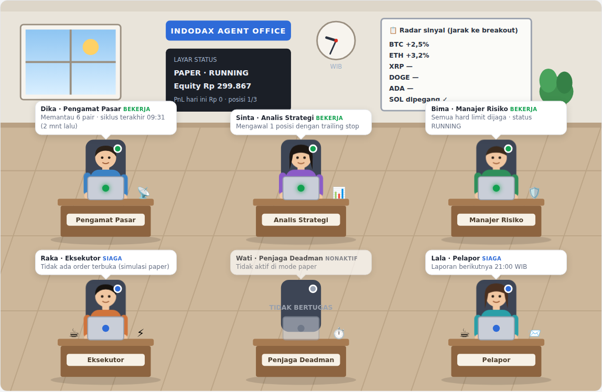

# Deploy ke VPS (paper trading — Fase 4)

Agent berjalan sebagai user Linux terpisah `indodax` di `/opt/indodax-agent`, lewat systemd dengan
`Restart=always` dan isolasi (tidak bisa menulis di luar `data/` & `logs/`, tidak bisa membaca
`/home`). Tidak ada port yang dibuka — Telegram memakai polling keluar. Firewall tidak disentuh.

> Mode live: ikuti [`docs/go_live_checklist.md`](../docs/go_live_checklist.md). Tanpa semua syarat
> terpenuhi, `MODE=live` ditolak saat start dan Telegram menerima daftar alasannya.

## 0. Prasyarat
- Python 3.11+ (`python3 --version`; Ubuntu 24.04 = 3.12 ✓, Ubuntu 22.04 = 3.10 ✗ → pakai
  `ppa:deadsnakes/ppa` untuk `python3.11`), paket venv (`sudo apt install python3-venv` atau
  `python3.11-venv`), `rsync`, `git`. `install.sh` memilih Python ≥ 3.11 secara otomatis.
- Sinkronisasi waktu aktif: `timedatectl` harus menampilkan `System clock synchronized: yes`.
  Jika belum: `sudo apt install chrony && sudo systemctl enable --now chrony`
  (agent menghentikan entry otomatis bila jam meleset > 500 ms dari server Indodax).

## 1. Ambil kode & install
```bash
git clone -b claude/wonderful-edison-y80upb https://github.com/tioantawibawa/tio-indodax.git ~/tio-indodax
cd ~/tio-indodax
sudo bash deploy/install.sh
```

## 2. Isi `.env` (rahasia — jangan pernah dikirim ke chat/Git)
```bash
sudo -u indodax nano /opt/indodax-agent/.env
```
- `MODE=paper`
- `INDODAX_API_KEY` / `INDODAX_API_SECRET` — key **baru** (key lama sudah terekspos di chat, hapus di
  https://indodax.com/trade_api). Izin view (+ trade untuk Fase 5), **tanpa withdraw**, whitelist IP VPS.
  Opsional di paper mode.
- `TELEGRAM_BOT_TOKEN` — token **baru** dari @BotFather (`/revoke` token lama).
- `TELEGRAM_CHAT_ID` — lihat langkah 3.

## 3. Cek sebelum start (semuanya read-only, tanpa order)
Folder `/opt/indodax-agent` hanya bisa dibuka user `indodax` (disengaja). Jalankan dari folder repo
Anda (`~/tio-indodax`) lewat helper yang menjalankan perintah sebagai user `indodax`:
```bash
cd ~/tio-indodax
# chat id: kirim /start ke bot Anda dulu, lalu
sudo bash deploy/agent-run.sh scripts.telegram_chat_id      # salin angkanya ke TELEGRAM_CHAT_ID di .env
sudo bash deploy/agent-run.sh scripts.smoke_public           # API publik + selisih jam
sudo bash deploy/agent-run.sh scripts.check_private_api      # key: backend mana, izin withdraw, saldo IDR
```
`check_private_api` harus menunjukkan **withdraw mungkin: False** (atau None bila hanya legacy).

## 4. Start
```bash
sudo systemctl enable --now indodax-agent
sudo systemctl status indodax-agent
```
Telegram akan menerima pesan **"Agent start"** berisi mode & semua limit aktif.

## Log
```bash
journalctl -u indodax-agent -f                 # live
journalctl -u indodax-agent --since today
sudo tail -f /opt/indodax-agent/logs/agent.log   # JSON, rotasi harian (30 hari)
```

## Update versi
```bash
cd ~/tio-indodax && git pull
sudo bash deploy/install.sh          # data/, logs/, .env dipertahankan
sudo systemctl restart indodax-agent
```
State (posisi, stop, status, jurnal) ada di `/opt/indodax-agent/data/agent.db` dan dibangun ulang
otomatis saat restart — tidak ada order ganda.

## Stop darurat
1. Telegram: `/kill CONFIRM` — batalkan semua order, status HALTED (posisi tetap dengan stop-loss).
2. Server: `sudo systemctl stop indodax-agent` (dan `disable` agar tidak start saat reboot).
3. Paling akhir: hapus/nonaktifkan API key di https://indodax.com/trade_api.

## Satpam (watchdog) & backup harian
**Satpam** berjalan terpisah dari agent (timer tiap 5 menit): cek siklus trading terakhir, status service,
ruang disk, umur backup → Telegram langsung (alert DARURAT bila ada posisi terbuka tanpa perlindungan
stop-loss). Alert diulang tiap 60 menit selama masalah ada, lalu pesan "pulih". **Backup** tiap hari
03:30 WIB: salinan konsisten + cek integritas + gzip, disimpan 14 hari di `data/backups/` dan dikirim ke
Telegram Anda (salinan di luar VPS; database tidak berisi API key/token).
```bash
sudo systemctl enable --now indodax-watchdog.timer indodax-backup.timer
sudo systemctl start indodax-backup.service        # backup pertama sekarang
sudo systemctl list-timers 'indodax-*' --no-pager
sudo bash deploy/agent-run.sh scripts.watchdog --dry-run   # lihat hasil cek tanpa kirim Telegram
```
**Satpam eksternal (opsional, disarankan)** — mendeteksi VPS mati total: buat check gratis di
https://healthchecks.io (period 5 menit, grace 15 menit, hubungkan email/Telegram), salin "ping URL" ke
`HEALTHCHECK_URL=` di `/opt/indodax-agent/.env`, lalu `sudo systemctl restart indodax-agent`.

**Memulihkan backup:** `sudo systemctl stop indodax-agent`, lalu sebagai user indodax di
`/opt/indodax-agent`: `gunzip -c data/backups/agent-YYYYMMDD-HHMM.db.gz > data/agent.db`, lalu
`sudo systemctl start indodax-agent`.

## Agent Office (dashboard pemantauan)
Dashboard web read-only yang menampilkan tiap bagian agent sebagai "pegawai" di mejanya (pengamat pasar,
analis strategi, manajer risiko, eksekutor, penjaga Deadman, pelapor) beserta equity, posisi, radar sinyal,
keputusan, transaksi, dan error. Proses terpisah: tidak membaca `.env`, membuka database **read-only**,
tidak bisa mengakses internet, dan hanya mendengarkan di `127.0.0.1:18787` (tidak ada port dibuka).
```bash
sudo systemctl enable --now indodax-office
sudo systemctl status indodax-office --no-pager | head -5
```
Buka dari laptop lewat SSH tunnel (ganti `<IP-VPS>`):
```bash
ssh -L 18787:127.0.0.1:18787 ubuntu@<IP-VPS>
```


lalu buka **http://localhost:18787** di browser laptop selama sesi SSH itu terbuka. Data diperbarui tiap
15 detik; agent menulis heartbeat tiap siklus (5 menit). Kendali tetap lewat Telegram.

## Perintah Telegram
`/status`, `/positions`, `/report`, `/pause`, `/resume`, `/kill CONFIRM`. Laporan harian otomatis
pukul 21:00 WIB. Bot hanya merespons `TELEGRAM_CHAT_ID` Anda.
